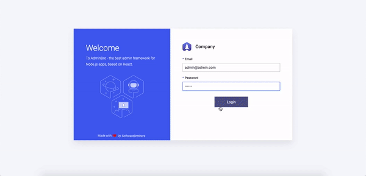

# Admin Bro: Users & Permisions

Library to easily implement a Role-Based Access Control(RBAC). Highly extensible, this library will help you to have an Admin Login Page and inside the admin, 2 Resources: Users and Roles.
**Only for Mongoose**

## How it looks


## Getting Started
```
npm install admin-bro-users-permissions
npm install cookie-parser
npm install express-session
```

Import the resources and the authentication closure
```
const userResource = require('admin-bro-users-permissions/resources/user')
const roleResource = require('admin-bro-users-permissions/resources/role')
const { authenticationClosure } = require('admin-bro-users-permissions/authentication')
const isAccessGranted = require('admin-bro-users-permissions/policies/isAccessGranted')
```

Set the resources to the AdminBro. eg:
```
const storeResource = {
    resource: mongoose.model('Store', {
        name: { type: String, required: true },
    }),
    options: {
        actions: {
            list: { // Added the role policy
                isAccessible: isAccessGranted({ resourceName: 'Store', actionRequested: 'list' }),
            },
            edit: { 
                isAccessible: isAccessGranted({ resourceName: 'Store', actionRequested: 'list' }),
            },
            //...etc
        },
    }
}

const adminBro = new AdminBro({
        resources: [
            ...storeResource,
            userResource.initResource(mongoose, {
                resourceSchema: {
                    name: { type: String, required: true }, //optional
                    ...yourSchema
                },
                resourceOptions: {
                    parent: {
                        name: 'Access'
                    },
                },
            }),
            roleResource.initResource(mongoose, {
                resourceOptions: {
                    parent: {
                        name: 'Access'
                    },
                },
            }),
        ],
    })
```

Build the authentication route passing the authentication closure:
```
const router = AdminBroExpress.buildAuthenticatedRouter(adminBro, {
    authenticate: authenticationClosure({ userModel: userResource.getModel(mongoose), roleModel: roleResource.getModel(mongoose) }),
})
```

Enable cookie-parsers and express-session into your express app:
```
app.use(cookieParser('secret'))
app.use(cookieSession())
```

Run migrations to create a Role and User in your database:
```
node ./node_modules/.bin/admin-bro-users-permissions-migrations --connectionString="mongodb://localhost:27017/yourDataBase"
```
You must receive the email and password to login in the panel

Done :white_check_mark::tada::tada: 
You now can start the AdminBro and you will see the login page and the Users & Roles resource.

## Highly extensible
You have access to all the pieces which is building this library. With that, you can extend or even create your on pieces to overwrite the main one.

##### Resources Methods
Method | Parameters
------ | -------
initResource | [mongoose](https://mongoosejs.com/docs/api/mongoose.html), Object{resourceSchema: [Mongoose Object Schema](https://mongoosejs.com/docs/schematypes.html), resourceOptions: [ResourceOptions](https://adminbro.com/ResourceOptions.html), resourceFeatures: [Array of Features](https://adminbro.com/tutorial-features.html)} <br><br> Returns: Array<[AdminBro Resources](https://adminbro.com/AdminBro.html#resourcesl)>
getSchema | [mongoose](https://mongoosejs.com/docs/api/mongoose.html), Object{[Mongoose Object Schema](https://mongoosejs.com/docs/schematypes.html)} <br><br>Returns: [Mongoose Schema](https://mongoosejs.com/docs/guide.html)
getOptions | Object{[ResourceOptions](https://adminbro.com/ResourceOptions.html)} <br><br>Returns: [Object of ResourceOptions](https://adminbro.com/ResourceOptions.html)
getFeatures | Array<[Features](https://adminbro.com/tutorial-features.html)> <br><br>Returns: Array of AdminBro Features

##### Authentication
Method | Parameters
------ | -------
authenticationClosure | Object({ userModel: User Mongoose Model, roleModel: Role Mongoose Model }) <br><br>Returns: Function<*authentication(email, password)*>
authentication | (email, password) <br><br>Returns: False *or* Object({email: String, password: String, role: Object})

Lets suppose besides all the login validations, you want to extend and add your own. You could do it using the authentication method. eg:

```
const userResource = require('admin-bro-users-permissions/resources/user')
const roleResource = require('admin-bro-users-permissions/resources/role')
const { authentication } = require('admin-bro-users-permissions/authentication')

const authenticationClosure = () => {
    return async (email, password) => {
        const matched = await authentication(email,password, userResource.getModel(mongoose), roleResource.getModel(mongoose))

        // Add your business logic here
        // return true or false
    }
}

const router = AdminBroExpress.buildAuthenticatedRouter(adminBro, {
    authenticate: authenticationClosure,
})
```

##### Policies
Policy | Parameters
------ | -------
isAccessGranted | Object({resourceName: String, actionRequested: String})

You can also add business logic to policy. eg:

```
const isAccessGranted = require('admin-bro-users-permissions/policies/isAccessGranted')

const myPolicy = ({ currentAdmin }) => {
    const isAccessGrantedClosure = isAccessGranted({ resourceName: 'Store', actionRequested: 'list' })
    const isGranted = isAccessGrantedClosure({currentAdmin})

    // add your business logic
    // return true or false
}

const storeResource = {
    resource: mongoose.model('Store', {
        name: { type: String, required: true },
    }),
    options: {
        actions: {
            list: { // Added the role policy
                isAccessible: isAccessGranted({ resourceName: 'Store', actionRequested: 'list' }),
            },
            //...etc
        },
    }
}
```

## Contribution
If you need features that is not implemented - feel free to implement and create PRs!
Plus we need some documentation, so if you are good in it - you are welcome.
